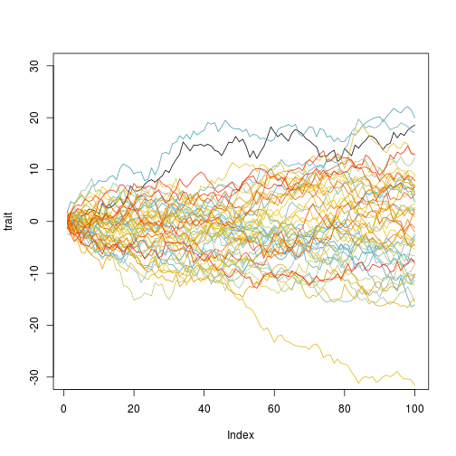
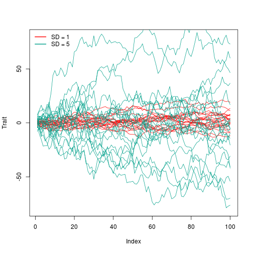
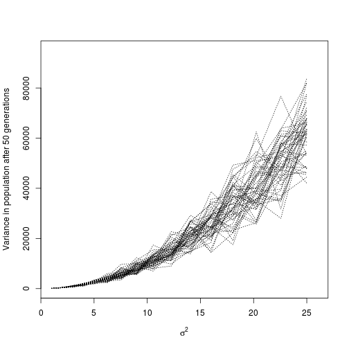
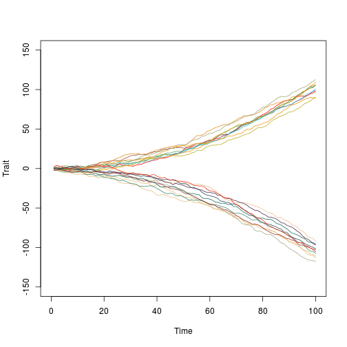
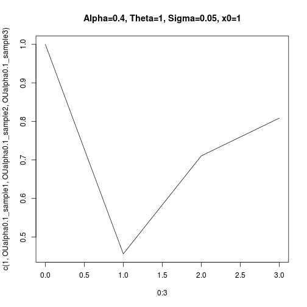
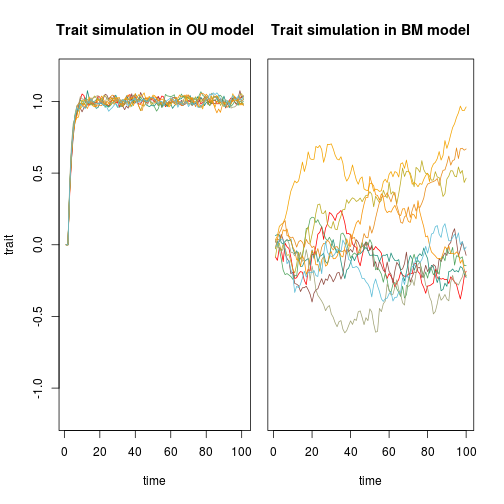

### Simulating Browning Motion evolution

We can simulate BM trait evolution by drawing random numbers from a normal distribution and generating their cumulative sum.

```r
library(geiger); library(wesanderson)
```

```
## Loading required package: ape
```

```r
num_generations <- 100
displace <- rnorm(num_generations)

traitvalue <- cumsum(displace)

plot(traitvalue, lwd = 2, type = "l")
```

 

## Exercise 1

Now let’s imagine we have 50 independent lineages that all start out with the same value of a continuous trait. If we let those 50 lineages evolve under Brownian motion (BM) what is the expected pattern of their trait values after 100 time units?

> The expected value is 0 (starting value), with a variance proportional to the length of time.


```r
num_lineages <- 50
colors <- wes_palette("Zissou", n = num_lineages, type = "continuous")
plot(cumsum(rnorm(100)), type="l", ylim=c(-30,30), ylab = "trait")
for(i in 1:num_lineages) {lines(cumsum(rnorm(100)), col = colors[i])}
```

 

## Exercise 2

Write an R block that plots Brownian evolution for 50 independent lineages for 50 time units side by side with BM for 100 time units. What is the effect of time on the diversity in trait values you see in those simulations? How does time affect diversity under BM?

> The time of evolution impacts on the variance, and not the mean, of the final distribution. SD scales linearly with time, so that `Var(t) == sigma^2*t`; `SD(t) = sqrt(Var(t))`


```r
num_lineages <- 50
colors <- wes_palette("Darjeeling", n = num_lineages, type = "continuous")

par(mar = c(5,4,4,2)+0.1)
layout(matrix (c(1, 2, 2), 1, 2, byrow = T))
```

```
## Warning in matrix(c(1, 2, 2), 1, 2, byrow = T): data length [3] is not a
## sub-multiple or multiple of the number of columns [2]
```

```r
# layout.show(n = 2)
plot(cumsum(rnorm(50)), type="l", ylim=c(-30,30), ylab = "trait", main = "50 time steps", 
     xlab = "time")
for(i in 1:num_lineages) {lines(cumsum(rnorm(50)), col = colors[i])}

par(mar = c(5, 0, 4, 2) + 0.1)
plot(cumsum(rnorm(100)), type="l", ylim=c(-30,30), ylab = "trait", yaxt = "n", 
     main = "100 time steps", xlab = "time")
for(i in 1:num_lineages) {lines(cumsum(rnorm(100)), col = colors[i])}
```

 

### Varying rates of evolution


```r
colors <- wes_palette("Darjeeling", n = 2)
par(mfrow = c(1,1), mar = c(5,4,4,2)+0.1)
plot(cumsum(rnorm(100)), type="l", ylim=c(-80,80), ylab="Trait", col=colors[1])
for(i in 1:20) lines(cumsum(rnorm(100)), col=colors[1])
for(i in 1:20) lines(cumsum(rnorm(100, sd=5)), col=colors[2])
legend("topleft", col = colors, legend = c("SD = 1", "SD = 5"), lwd = 2, bty = "n")
```

 

## Exercise 3  

What is the rate parameter of Brownian motion? How does trait variance in a clade evolving under BM scale with rate?

> There appears to be an exponential increase in population variance with sigma^2: 


```r
sigmas <- seq(from = 1, to = 5, by = 0.25)

timesteps <- 100
variances <- numeric(length(sigmas))
lineages <- seq(from = 1, to = 50)
lineage_final <- numeric(length(lineages))

plot(1, type = "n", xlim = c(1, max(sigmas)^2+1), ylim = c(0, 95000), 
     xlab = bquote(sigma^2), 
     ylab = "Variance in population after 50 generations")

for(j in 1:50) {

  # Crappy way to do this with a loop:
  #   for (i in 1:length(sigmas)) {
  #     lineage_final <- sapply(lineages, function(x) cumsum(rnorm(timesteps+1, 
  #                       sd = sigmas[i]^2))[timesteps+1])
  #     variances[i] <- var(lineage_final)
  #   }
  
  # Slicker way of doing this with an apply function
  variances <- sapply(sigmas, function(x) var(sapply(lineages, function (y)
    cumsum(rnorm(timesteps+1, sd = x^2))[timesteps+1])))

  lines(x = sigmas^2, y = variances, lwd = 1, lty = 3)
}
```

 


### Simulating traits on trees

See below that polar bears and grizzlies diverged from one another 1 MY ago while spectacled bears have evolved independently from that clade for 5 million years. Think about what this tree implies about the evolution of a continuous trait.    
> This implies that Spectacled bears have had longer to evolve independently away from polar+grizzlybear- so the latter two should be fairly similar to one another, while the spectacled bear might be much different

Node 4, the root of the tree, represents the common ancestor of all three bears. Let’s imagine we are interested in simulating the evolution of body size from this common ancestor. If the ancestral value was 250 kg we could simulate one outcome of BM from node 4 to spectacled bear by drawing one “walk” away with a step size that is determined by both the sigma^2 (the Brownian rate) and time. To get the correct standard deviation for multiple time steps at once we simple take the square root of the product of time X sigma^2. See the example below:


```r
tree<-read.tree(text="((grizzlybear:1, polarbear:1):4, spectacledbear:5);")
plot(tree)
nodelabels()
axisPhylo()
```

 

```r
rootMass <- 250 # size of ancestor
sigmasq = 2.5 # Brownian rate
time = 5 # 5 million years of independent evolution from the root
sd <- sqrt(time * sigmasq) # Brownian evolution is proportional to rate X time)
specbearDeltaMass <- rnorm(1, mean = 0, sd = sd)
specbearMass <- rootMass + specbearDeltaMass
specbearMass
```

```
## [1] 250.1013
```

```r
# Another way to do this using the tree structure itself to supply the time argument
# Tree tip labels are numbered from top to bottom, so in our tree 
# spectacled bear = 1, polarbear = 2, and grizzly = 3
specbearDeltaMass<-rnorm(1, mean = 0, sd = sqrt(sigmasq*tree$edge.length[1])) 
# NOTE: I am not sure this works- tree$edge.length[1] == 4, not 5 as it should be for specbear!
specbearMass <- rootMass + specbearDeltaMass
specbearMass
```

```
## [1] 246
```


## Exercise 4. 
Write a block of R code that simulate BM evolution for this three taxon tree. You can do this as a series of steps or write a general function.


```r
# Trying to write a general function but not set on how to go about this best
# simulate_trait <- function(phy, node_trait, bmrate) {
#   # Simulate BM on each branch
#   per_branch <- sapply(phy$edge.length, function(x) rnorm(1, mean = 0, sd = sqrt(bmrate*x)))
# }

specbearMass <- rootMass + rnorm(1, mean = 0, sd = sqrt(sigmasq*5))
node5mass <- rootMass + rnorm(1, mean = 0, sd = sqrt(sigmasq*4))
polarbearMass <- node5mass + rnorm(1, mean = 0, sd = sqrt(sigmasq*1))
grizzlybearMass <- node5mass + rnorm(1, mean = 0, sd = sqrt(sigmasq*1))
```

## Trends in trait evolution

What if we think that there has been a trend in the evolution of a trait? One way we could simulate this process is by saying that the mean of the normal distrbution is changing with time. We will do this by adding a new parameter to our model, mu. mu is going to shift the mean of the random normal distribution as a function of time (see the function below)


```r
# a function that requires 
# mu which is the trend parameter showing how the mean of the normal distribution changes over time, 
# time the length of the simulation and stdev the standard deviation of the normal distribution, 
# it assumes the starting ancestral trait value is 0

bmtrend <- function(time, mu, stdev){ 
  displace <- vector(length=time) 
    for(i in 1:time){
      # sample from rnorm with a mean with a mean of mu multiplied by the iteration
      displace[i]<-rnorm(1, mean=mu*i, sd=stdev) 
    }
  traj<-cumsum(displace)   
  return(traj) 
}
```

Now we are going to run this bmtrend function 10 times using the replicate function, once with a mu of 0.02 and the other with mu=-0.02


```r
par(mfrow = c(1,1))
bmtrend0.02 <- replicate(10, bmtrend(100, 0.02, 1))
bmtrendneg0.02 <- replicate(10, bmtrend(100, -0.02, 1))

cols1 <- wes_palette("Darjeeling", n = 10, type = "continuous") 
cols2 <- wes_palette("Rushmore", n = 10, type = "continuous") 
 
plot(bmtrend0.02[,1], xlim=c(0,100), ylim=c(-150, 150), 
     type="l", col=cols1[1], xlab="Time", ylab="Trait")
for(i in 2:10) lines(bmtrend0.02[,i], col=cols1[i])
for(i in 1:10) lines(bmtrendneg0.02[,i], col=cols2[i])
```

 


## Exercise 5.   
Simulate 15 runs of a trend process for two groups of species: one with a mu of 0.5 and and the other with a mu of -0.5 for 100 MY. If you were to measure trait diversity in these groups at 100 only (in other words, if you did not knowm the true trait history) is there any information in those trait values that could distinguish evolution under a trend from regular Brownian evolution? Can you think of any additional information that would be helpful in distinguishing these models?

> With only the trait values at the tip, we would not be able to determine whether the clade has evolved under a trended BM model or a neutral BM model, as the only factor distinguishing the two is the historical location of the distribution mean. Having an estimate of the trait value at the base of tree would give us a lot of confidence in determining the model of evolution in this group. 


```r
bmtrend5 <- replicate(15, bmtrend(100, .5, 1))
bmtrendneg5 <- replicate(15, bmtrend(100, -.5, 1))

cols1 <- wes_palette("Darjeeling", n = 10, type = "continuous") 
cols2 <- wes_palette("Rushmore", n = 10, type = "continuous") 
 
plot(bmtrend5[,1], xlim = c(0,100), ylim = c(-2500, 2500), 
     type = "l", col = cols1[1], xlab = "Time", ylab = "Trait",
     main = "Simulating traits with mus of 0.5/-0.5")
for(i in 2:10) lines(bmtrend5[,i], col = cols1[i])
for(i in 1:10) lines(bmtrendneg5[,i], col = cols2[i])
```

 

## Simulating Orstein-Uhlenbeck trait evolution 

The final model we will consider is the Ornstein-Uhlenbeck or OU model. This model contains BM but adds a constraint parameter that “pulls” the trait towards a peak value with increasing strength as that trait wanders away. There are four parameters to consider for OU: $\theta$ (the optimal trait value), $\alpha$ (the pull towards the optima), $\sigma$ (sigma^2 the stochastic (Brownian) motion parameter) and the starting value for the trait(x0). OU models a change in trait X over an increment in time t as 

$dX_{t} = \alpha*\theta - X_{t} dt + \sigma dB_{t}$

We will begin our invesitgation of OU by considering all lineages to be independent. Let’s assume that the ancestral value of the trait is 0, the optimum is 1, the pull towards the optima is 0.4 and sigma^2=0.05:


```r
theta <- 1 # Optimal value
alpha <- 0.4 # Strength of pull to optimal value
sigma <- 0.05 # Rate parameter
x0 <- 0 # Starting value of trait


# Drawing from OU
OUalpha0.1_sample1<- x0 + alpha*(theta-x0)+sigma*(rnorm(1,mean=0))

# the next sample would be

OUalpha0.1_sample2<- OUalpha0.1_sample1 + alpha*(theta-OUalpha0.1_sample1)+sigma*(rnorm(1,mean=0))

OUalpha0.1_sample3<- OUalpha0.1_sample2 + alpha*(theta-OUalpha0.1_sample2)+sigma*(rnorm(1,mean=0))

plot(x=0:3, y=c(1,OUalpha0.1_sample1, OUalpha0.1_sample2, OUalpha0.1_sample3), type="l", main="Alpha=0.4, Theta=1, Sigma=0.05, x0=1")
```

 

```r
# This seems like a silly way to go about this.
# Writing a function to acheive this (probably pre-emtping a future chunk here)

trait_ou <- function(num_generations, theta, alpha, sigma, x0){
  
  time <- 1:num_generations
  traits <- numeric(num_generations+1)
  traits[1] <- x0
  
  for(i in 2:num_generations+1) {
    traits[i] <- traits[i-1] + alpha*(theta-traits[i-1] + sigma*rnorm(1, mean = 0))
  }
  return(traits)
}

# Do ten runs
trait_ou_outputs <- replicate(10, trait_ou(100, theta, alpha, sigma, x0))
cols <- wes_palette("Darjeeling", n = ncol(trait_ou_outputs), type = "cont")
plot(trait_ou_outputs[,1], col = cols[1], type = "l", ylim = c(-.2, 1.2), xlab = "time", 
     ylab = "trait", main = "Trait simulation in OU model")
for(i in 2:ncol(trait_ou_outputs)) {
  lines (trait_ou_outputs[,i], col = cols[i])
}
```

 

## Exercise 6.  
Look at the plot you have just created. Describe the evolutionary trajectory of the trait under OU. Make a second plot of BM with the same starting value, sigma, and time and show it side by side with your OU simulation. Compare the evolutionary trajectories and ending diversities of BM and OU. In what ways is OU different from BM?

> For the first ~20 generations, the trajectory of the traits is dominated by a shift towards the optimum value of 1- the BM component of the model is not contributing very much to the trajectory. The lineages then start to drift around 1, but the variance in the trait does *not* increase with time, as we saw above in the pure BM model. 


```r
theta <- 1 # Optimal value
alpha <- 0.4 # Strength of pull to optimal value
sigma <- 0.05 # Rate parameter
x0 <- 0 # Starting value of trait

par(mfrow = c(1,2))
num_lineages <- 10
trait_ou_outputs <- replicate(num_lineages, trait_ou(100, theta, alpha, sigma, x0))
cols <- wes_palette("Darjeeling", n = num_lineages, type = "cont")
par(mar = c(5,4,4,0)+0.1)
plot(trait_ou_outputs[,1], col = cols[1], type = "l", ylim = c(-1.2, 1.2), xlab = "time", 
     ylab = "trait", main = "Trait simulation in OU model")
for(i in 2:ncol(trait_ou_outputs)) {
  lines (trait_ou_outputs[,i], col = cols[i])
}
par(mar = c(5,1,4,2)+0.1)
trait_bm_outputs <- replicate(num_lineages, cumsum(rnorm(100, mean = 0, sd = sigma)))
plot(trait_bm_outputs[,1], col = cols[1], type = "l", ylim = c(-1.2, 1.2), xlab = "time", 
     ylab = "", main = "Trait simulation in BM model", yaxt = "n")
for(i in 2:ncol(trait_bm_outputs)) {
  lines (trait_bm_outputs[,i], col = cols[i])
}
```

 

See Mike's document for exploration of parameter space. May make a `shiny` app for this?

# Part II: Model fitting


```r
library(parallel)
haem_tree <- read.tree("~/grad/courses/UCLA/eeb_200a_evolution/alfaro_docs/assignments/lab2-morph-evo/Haemulidae4models.tre")
haem_dat <- read.csv("~/grad/courses/UCLA/eeb_200a_evolution/alfaro_docs/assignments/lab2-morph-evo/Haemulidae4models.csv", stringsAsFactors = FALSE)
str(haem_dat)
```

```
## 'data.frame':	50 obs. of  4 variables:
##  $ taxon          : chr  "Haemulon_striatum" "Haemulon_steindachneri_Pacific" "Haemulon_macrsotomum" "Anisotremus_caesius" ...
##  $ Standard_Length: num  2.11 2.25 2.29 2.2 2.08 ...
##  $ Eye_Width      : num  1.05 1.17 1.24 1.15 1.15 ...
##  $ Buccal_Width   : num  1.03 1.31 1.28 1.21 1.06 ...
```

```r
########################################################################
# Adding this next chunk to make the tip values match the trait matrix #
########################################################################
rownames(haem_dat) <- haem_dat$taxon
order <- match(haem_tree$tip.label, rownames(haem_dat))
haem_dat <- haem_dat[,][order,]
########################################################################

trait <- haem_dat$Standard_Length
names(trait) <- haem_tree$tip.label # Assigning the appropriate tip labels to the trait object

# Check that things are OK now:
trait["Microlepidotus_brevipinnis"] == haem_dat["Microlepidotus_brevipinnis","Standard_Length"]
```

```
## Microlepidotus_brevipinnis 
##                       TRUE
```

```r
trait["Haemulon_macrsotomum"] == haem_dat["Haemulon_macrsotomum","Standard_Length"]
```

```
## Haemulon_macrsotomum 
##                 TRUE
```

```r
# Good to go!

# Use fitContinuous() in geiger to fit a BM model to this tree
BM_model <- fitContinuous(haem_tree, trait, model="BM"); BM_model
```

```
## GEIGER-fitted comparative model of continuous data
##  fitted 'BM' model parameters:
## 	sigsq = 0.000841
## 	z0 = 2.239316
## 
##  model summary:
## 	log-likelihood = 35.701613
## 	AIC = -67.403226
## 	AICc = -67.147907
## 	free parameters = 2
## 
## Convergence diagnostics:
## 	optimization iterations = 100
## 	failed iterations = 0
## 	frequency of best fit = 1.00
## 
##  object summary:
## 	'lik' -- likelihood function
## 	'bnd' -- bounds for likelihood search
## 	'res' -- optimization iteration summary
## 	'opt' -- maximum likelihood parameter estimates
```

```r
OU_model <- fitContinuous(haem_tree, trait, model="OU"); OU_model
```

```
## GEIGER-fitted comparative model of continuous data
##  fitted 'OU' model parameters:
## 	alpha = 0.431511
## 	sigsq = 0.007712
## 	z0 = 2.242112
## 
##  model summary:
## 	log-likelihood = 47.144500
## 	AIC = -88.288999
## 	AICc = -87.767260
## 	free parameters = 3
## 
## Convergence diagnostics:
## 	optimization iterations = 100
## 	failed iterations = 0
## 	frequency of best fit = 0.41
## 
##  object summary:
## 	'lik' -- likelihood function
## 	'bnd' -- bounds for likelihood search
## 	'res' -- optimization iteration summary
## 	'opt' -- maximum likelihood parameter estimates
```

```r
BM_model$opt$lnL
```

```
## [1] 35.70161
```

```r
OU_model$opt$lnL
```

```
## [1] 47.1445
```

```r
# One way to assess the difference between these two models more formally is the likelihood ratio test.
# BM is a special case of OU (for alpha=0), so the models are nested and the LR test is fine.
# Note that for thorough tests you should account for phylogenetic uncertainty and perform parameteric bootstrapping.
delta_BM_OU <- 1-pchisq(2*(OU_model$opt$lnL - BM_model$opt$lnL),1)
delta_BM_OU
```

```
## [1] 1.719196e-06
```

```r
BM_model$opt$aicc # Higher AICc score is worse!
```

```
## [1] -67.14791
```

```r
OU_model$opt$aicc # Lower AICc score is better!
```

```
## [1] -87.76726
```

```r
# AIC and AICc scores are usually presented as differences to the best model (lowest score).
all_aicc <- c(BM_model$opt$aicc, OU_model$opt$aicc)
delta_aicc <- all_aicc - min(all_aicc) 
# This may seem a bit circumstantial for just two models, but pays for additional models.
delta_aicc # delta AIC or AICC scores >2 ususally considered to provide positive support
```

```
## [1] 20.61935  0.00000
```

```r
# AIC and AICc scores can also be expressed as Akaike weights, 
# representing relative likelihood of the model 
# (=exp( -0.5 * deltaAIC score for that model). 
# Akaike weight for a given model are the relative likelihood of the model 
# divided by sum of all relative likelihhods across all models:

rel_L <- exp(-delta_aicc*0.5)
AK_weights <- rel_L/sum(rel_L)
AK_weights
```

```
## [1] 0.0000333081 0.9999666919
```


## Exercise 7

Your assignment is to 1) choose buccal width or eye width as your trait 2) compare the fit of BM, OU, trend, and EB models using likelihood and AIC. The likelihood ratio test won’t be very useful here as you don’t have a nested hierachy of models. Report the likelihoods, AICcs, and delta AICs in a table (see Lab 1 for an example of how to extract and display these in an orderly way). What model or models fit your data best? Can you explain what the pattern of variation in your data set must be to support those fits? In other words, do you have any intuition for how clade trait diversity should scale with clade diversity for BM versus OU? How do these expectations differ for the trend model? We did not discuss the early burst model yet but you can read a brief description of the model using the help function. How should trait diveristy change through time under EB?

> **BM** is the Brownian motion model (Felsenstein 1973), which assumes the correlation structure among trait values is proportional to the extent of shared ancestry for pairs of species. Default bounds on the rate parameter are sigsq=c(min=0,max=Inf). The same bounds are applied to all other models, which also estimate sigsq    
    **OU** is the Ornstein-Uhlenbeck model (Butler and King 2004), which fits a random walk with a central tendency with an attraction strength proportional to the parameter alpha. The OU model is called the hansen model in ouch, although the way the parameters are fit is slightly different here. Default bounds are alpha = c(min = 0, max = 150)     
    **EB** is the Early-burst model (Harmon et al. 2010) and also called the ACDC model (accelerating-decelerating; Blomberg et al. 2003). Set by the a rate parameter, EB fits a model where the rate of evolution increases or decreases exponentially through time, under the model r[t] = r[0] * exp(a * t), where r[0] is the initial rate, a is the rate change parameter, and t is time. The maximum bound is set to -0.000001, representing a decelerating rate of evolution. The minimum bound is set to log(10^-5)/depth of the tree.     
    **trend** is a diffusion model with linear trend in rates through time (toward larger or smaller rates). Default bounds are slope = c(min = -100, max = 100)


```r
buccal <- haem_dat$Buccal_Width
names(buccal) <- rownames(haem_dat)

# Verify
buccal["Microlepidotus_brevipinnis"] == haem_dat["Microlepidotus_brevipinnis","Buccal_Width"]
```

```
## Microlepidotus_brevipinnis 
##                       TRUE
```

```r
buccal["Haemulon_macrsotomum"] == haem_dat["Haemulon_macrsotomum","Buccal_Width"]
```

```
## Haemulon_macrsotomum 
##                 TRUE
```

```r
models <- c("BM", "OU", "EB", "trend")
buccal_models <- list()

buccal_models [["BM"]] <- fitContinuous(haem_tree, buccal, model="BM")
buccal_models [["OU"]] <- fitContinuous(haem_tree, buccal, model="OU", bounds=list(alpha=c(0, 5)))
buccal_models [["EB"]] <- fitContinuous(haem_tree, buccal, model="EB", bounds = list(a = c(-10,10)))
buccal_models [["trend"]] <- fitContinuous(haem_tree, buccal, model="trend")
```

```
## Warning in fitContinuous(haem_tree, buccal, model = "trend"): Parameter estimates appear at bounds:
## 	slope
```

```r
lnLs <- sapply(buccal_models, function(x) x$opt$lnL); lnLs
```

```
##       BM       OU       EB    trend 
## 14.26972 26.87553 26.87553 18.38975
```

```r
aiccs <- sapply(buccal_models, function(x) x$opt$aicc); aiccs
```

```
##        BM        OU        EB     trend 
## -24.28412 -47.22931 -47.22931 -30.25777
```

```r
daiccs <- sapply(buccal_models, function(x) x$opt$aicc-min(as.numeric(aiccs))); daiccs
```

```
##           BM           OU           EB        trend 
## 2.294519e+01 1.126210e-11 0.000000e+00 1.697155e+01
```


> It appears that either the OU or the EB models are the best fit to the buccal width data- this makes a lot of sense given the description of EB. EB fits a model in which the rate of evolution changes exponentially through time. If the rate of evolution increases exponentially and then decreases exponentially, this would look very similar to an OU model with a large value of alpha. If alpha is large in OU, there is a really strong pull towards an optimal trait value, and as the optimum is reached, the rate of evolution slows until the trait oscillates around the optimum.
